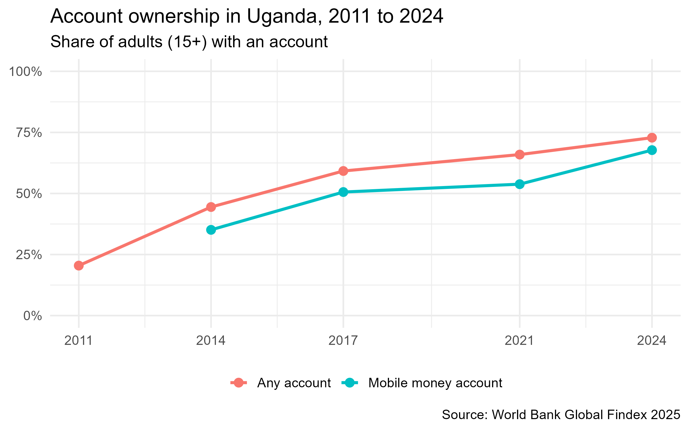
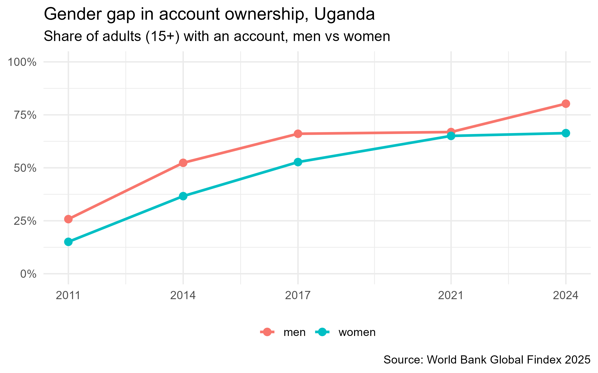

# Mobile Money & Financial Inclusion Analytics (Uganda)

An end-to-end data science project in R analyzing mobile money usage and financial inclusion in Uganda, using the World Bank Global Findex 2025 database.

## Key findings

- Account ownership among Ugandan adults rose from **20.5% in 2011 to 72.8% in 2024**.
- Mobile money accounts reached **67.7% of adults in 2024**, up from 35.1% in 2014.
- The gender gap in account ownership was **13.9 percentage points in 2024** (men 80.3%, women 66.4%), after nearly closing in 2021.

## Charts

## Project structure

- `scripts/02_explore_uganda.R` loads and filters the data
- `scripts/03_visualize.R` creates the charts
- `outputs/` holds the saved charts

## Data

World Bank Global Findex Database 2025. Download the country-level CSV from the World Bank website and place it in the `data/` folder.

## Tools

R, tidyverse, ggplot2, tidymodels (coming next), Shiny (coming next), Quarto (coming next)

## Author

Peter Kugonza, Data Science and Analytics student